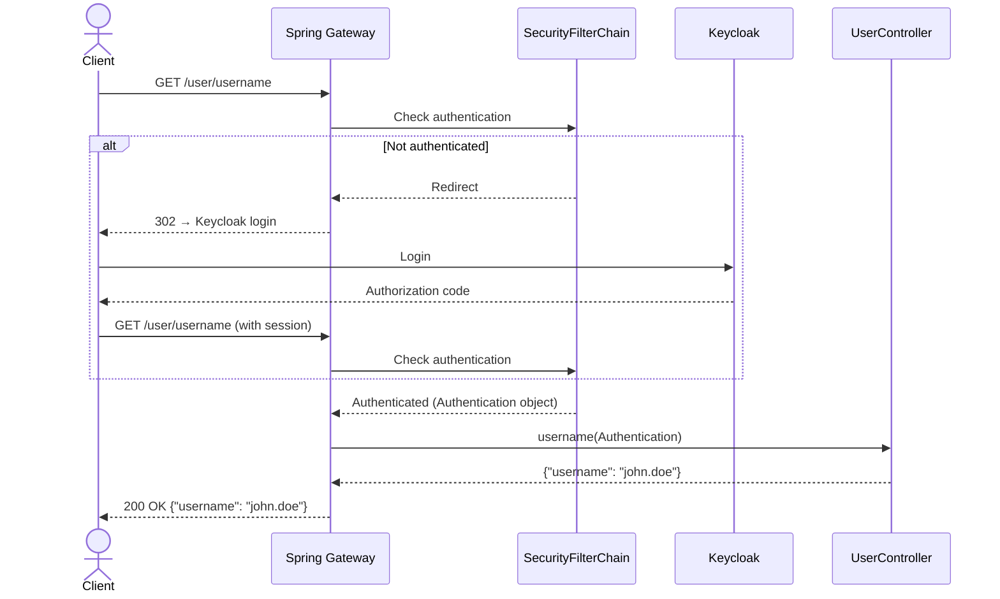
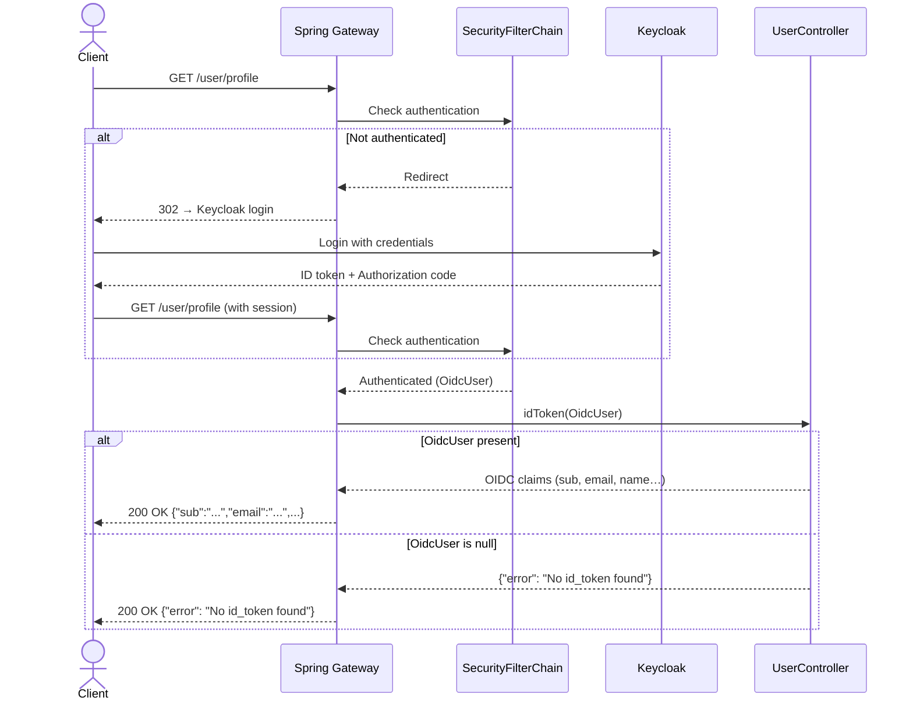
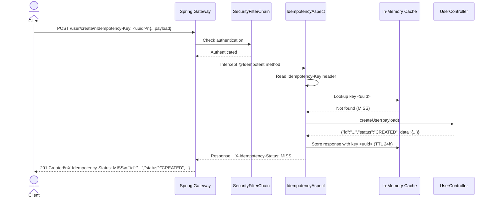
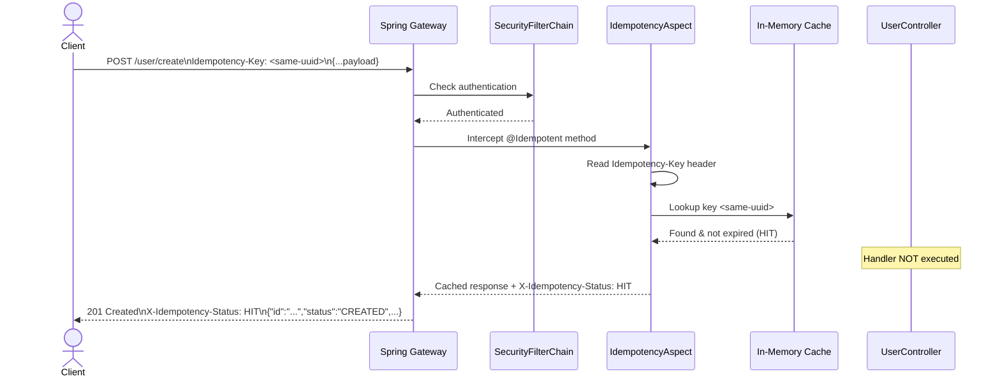
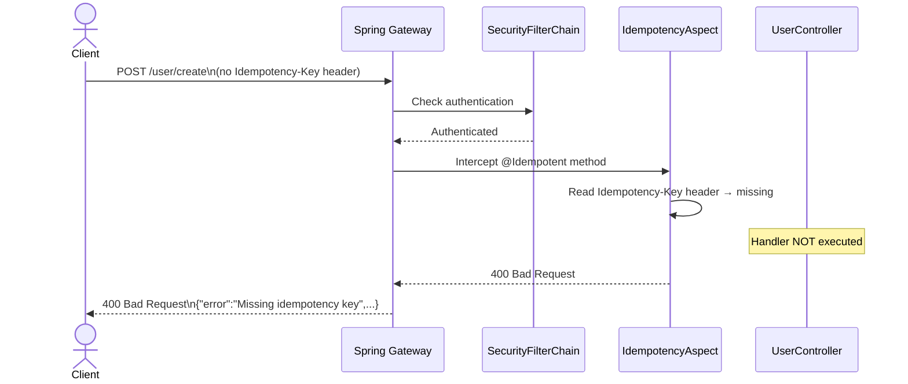

# User API Documentation

Base URL: `/user`

All endpoints require authentication via OAuth2/OIDC (Keycloak). Unauthenticated requests are redirected to the Keycloak login page.

---

## Endpoints

### 1. Get Username

Retrieves the authenticated user's username from the current security context.

| Field        | Value             |
|-------------|-------------------|
| **Method**  | `GET`             |
| **Path**    | `/user/username`  |
| **Auth**    | Required (OAuth2) |
| **Idempotent** | Yes (GET)      |

#### Response `200 OK`

```json
{
  "username": "john.doe"
}
```

#### Sequence Diagram



---

### 2. Get User Profile

Returns the full OIDC ID token claims (profile, email, sub, etc.) for the authenticated user.

| Field        | Value            |
|-------------|------------------|
| **Method**  | `GET`            |
| **Path**    | `/user/profile`  |
| **Auth**    | Required (OIDC)  |
| **Idempotent** | Yes (GET)     |

#### Response `200 OK` — success

```json
{
  "sub": "a1b2c3d4-...",
  "preferred_username": "john.doe",
  "email": "john.doe@example.com",
  "given_name": "John",
  "family_name": "Doe",
  "email_verified": true
}
```

#### Response `200 OK` — no OIDC user found

```json
{
  "error": "No id_token found",
  "id_token": null
}
```

#### Sequence Diagram



---

### 3. Create User *(Idempotent)*

Creates a new user resource. This endpoint is **idempotent** — repeating the same request with the same `Idempotency-Key` header will return the original cached response without executing the creation logic again.

| Field        | Value             |
|-------------|-------------------|
| **Method**  | `POST`            |
| **Path**    | `/user/create`    |
| **Auth**    | Required (OAuth2) |
| **Idempotent** | Yes — via `Idempotency-Key` header |

#### Request Headers

| Header            | Required | Description                                              |
|-------------------|----------|----------------------------------------------------------|
| `Idempotency-Key` | **Yes**  | A unique client-generated key (e.g., UUID) per operation |

#### Request Body

`Content-Type: application/json`

```json
{
  "username": "john.doe",
  "email": "john.doe@example.com",
  "firstName": "John",
  "lastName": "Doe"
}
```

Any JSON object is accepted as the payload.

#### Response `201 Created` — first call (cache MISS)

```json
{
  "id": "f47ac10b-58cc-4372-a567-0e02b2c3d479",
  "status": "CREATED",
  "data": {
    "username": "john.doe",
    "email": "john.doe@example.com"
  }
}
```

#### Response `201 Created` — duplicate call (cache HIT)

Same body as the first call. No new resource is created.

#### Response `400 Bad Request` — missing idempotency key

```json
{
  "error": "Missing idempotency key",
  "header": "Idempotency-Key"
}
```

#### Response Headers

| Header                  | Value  | Description                              |
|-------------------------|--------|------------------------------------------|
| `X-Idempotency-Status`  | `MISS` | First successful call, response cached   |
| `X-Idempotency-Status`  | `HIT`  | Duplicate call, response served from cache |

#### Sequence Diagram — First Call (MISS)



#### Sequence Diagram — Duplicate Call (HIT)



#### Sequence Diagram — Missing Idempotency-Key



---

## Idempotency Behaviour

The `POST /user/create` endpoint uses the `@Idempotent` AOP annotation backed by an in-memory cache (`ConcurrentHashMap`).

| Scenario                       | Behaviour                                      |
|-------------------------------|------------------------------------------------|
| First request with a new key  | Handler executes, response cached, `MISS`      |
| Repeat request with same key  | Cached response returned, handler skipped, `HIT` |
| Request without key           | `400 Bad Request` returned                     |
| Key expired (TTL elapsed)     | Cache evicted, handler re-executes             |

**Default TTL:** `86400` seconds (24 hours).

To customise TTL or header name on any endpoint:

```java
@Idempotent(headerName = "X-Request-Id", ttlSeconds = 3600)
```

> **Note:** The in-memory cache is **not shared across multiple application instances**. For distributed deployments, replace the `ConcurrentHashMap` in `IdempotencyAspect` with a Redis-backed store.

---

## Error Reference

| HTTP Status | Scenario                              |
|-------------|---------------------------------------|
| `400`       | Missing `Idempotency-Key` header      |
| `401`       | Not authenticated                     |
| `302`       | Redirect to Keycloak login            |
